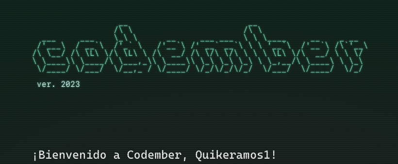
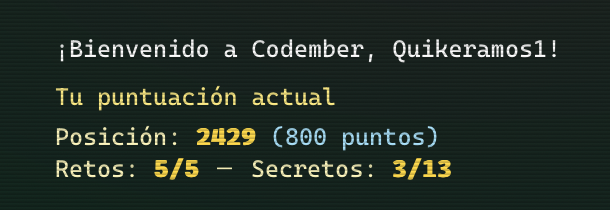

# Soluciones a retos de Codember.dev

## Reto 01

CHALLENGE_01.txt

El reto
Un espía está enviando mensajes encriptados.

Tu misión es crear un programa que nos ayude a buscar patrones...

Los mensajes son palabras separadas por espacios como este:
gato perro perro coche Gato peRRo sol

Necesitamos que el programa nos devuelva el número de veces que aparece cada palabra en el mensaje, independientemente de si está en mayúsculas o minúsculas.

El resultado será una cadena de texto con la palabra y el número de veces que aparece en el mensaje, con este formato:
gato2perro3coche1sol1

¡Las palabras son ordenadas por su primera aparición en el mensaje!

Más ejemplos:
    llaveS casa CASA casa llaves -> llaves2casa3
    taza ta za taza -> taza2ta1za1
    casas casa casasas -> casas1casa1casas1

Cómo resolverlo 
    1. Resuelve el mensaje que encontrarás en este archivo: https://codember.dev/data/message_01.txt

    2. Envía tu solución con el comando "submit" en la terminal, por ejemplo así:
    submit perro3gato3coche1sol1

## Reto 02

CHALLENGE_02.txt

Mini Compiler Challenge
En el mundo del espionaje, se utiliza un lenguaje de codificación con símbolos que realizan operaciones matemáticas simples.

Tu tarea es crear un mini compilador que interprete y ejecute programas escritos en este lenguaje de símbolos.

Las operaciones del lenguaje son las siguientes:

"#" Incrementa el valor numérico en 1.
"@" Decrementa el valor numérico en 1.
"*" Multiplica el valor numérico por sí mismo.
"&" Imprime el valor numérico actual.
El valor numérico inicial es 0 y las operaciones deben aplicarse en elorden en que aparecen en la cadena de símbolos.

Ejemplos de entrada:
    Entrada: "##*&"
    Salida esperada: "4"
    Explicación: Incrementa (1), incrementa (2), multiplica (4), imprime (4).

Entrada: "&##&*&@&"
Salida esperada: "0243"
Explicación: Imprime (0), incrementa (1), incrementa (2), imprime (2), multiplica (4), imprime (4), decrementa (3), imprime (3).

Tu desafío:
    Desarrolla un mini compilador que tome una cadena de texto y devuelva otra cadena de texto con el resultado de ejecutar el programa.

Cómo resolverlo
    1. Resuelve el mensaje que encontrarás en este archivo: https://codember.dev/data/message_02.txt

    2. Crea un programa al que le pases como entrada el mensaje anterior. Envía la salida con el comando "submit" en la terminal, por ejemplo así:
    submit 024899488

solucion= 024899455

## Reto 03

CHALLENGE_03.txt

El Desafío del Cifrado Espía

    Un grupo de espías ha descubierto que su sistema de cifrado de mensajes está comprometido.

    Han encontrado algunas contraseñas que no cumplen con laPolítica de Seguridad de Cifrado que tenían establecida cuando fueron creadas.

    Para solucionar el problema, han creado una lista (tu entrada al desafío) de contraseñas (según la base de datos corrupta) y la política de seguridad cuando esa clave fue establecida.

Ejemplo de la lista:

    2-4 f: fgff
    4-6 z: zzzsg
    1-6 h: hhhhhh
    Cada línea indica, separado por :, la política de la clave y la clave misma.

    La política de la clave especifica el número mínimo y máximo de veces que un carácter dado debe aparecer para que la clave sea válida. Por ejemplo, 2-4 f significa que la clave debe contener f al menos 2 veces y como máximo 4 veces.

    Sabiendo esto, en el ejemplo anterior, hay 2 claves válidas:

    La segunda clave, zzzsg, no lo es; contiene 3 veces la letra z, pero necesita al menos 4. Las primeras y terceras claves son válidas: contienen la cantidad adecuada de f y h, respectivamente, según sus políticas.

Tu desafío:

    Determina cuántas claves de cifrado son válidas según sus políticas.

Cómo resolverlo

    1. Analiza la lista de políticas y claves de cifrado que encontrarás en este archivo: https://codember.dev/data/encryption_policies.txt

    2. Crea un programa que devuelva la clave inválida número 42 (de todas las claves inválidas, la 42ª en orden de aparición). Por ejemplo:
    submit bqamidgewtbuz

resultado: bgamidqewtbus

## Reto 04

CHALLENGE_04.txt

** Hackers dañan sistema de archivos **

    En un mundo donde la información es poder, un hacker conocido como Savipo Yatar descubre una serie de archivos en un servidor altamente protegido.

    Estos archivos contienen secretos que podrían cambiar el curso de la historia. Pero hay un problema: algunos de los archivos son falsos, diseñados para engañar a los intrusos. Savipo Yatar debe determinar rápidamente cuáles archivos son reales y cuáles son falsos.

    Cada archivo tiene un nombre con dos partes, separadas por un guion (-). La primera parte es una cadena alfanumérica y la segunda es unchecksum, que es una cadena formada por los caracteres que sólo aparecen una vez en la primera parte y en el orden en que aparecen.

    Escribe un programa que determine si un archivo es real o falso basado en estas reglas.

Ejemplos:

    Nombre del archivo: xyzz33-xy
        Resultado: ✅ Real (El checksum es válido)

    Nombre del archivo: abcca1-ab1
    Resultado: ❌ Falso (El checksum debería ser b1, es incorrecto)

    Nombre del archivo: abbc11-ca
    Resultado: ❌ Falso (El checksum debería ser ac, el orden es incorrecto)

Cada línea indica el nombre del archivo y su correspondiente checksum, separados por un guion (-).

** Cómo resolverlo **

    1. Analiza la lista de nombres de archivos y sus checksums que encontrarás en este archivo: https://codember.dev/data/files_quarantine.txt

    2. Busca el archivo real número 33 (de todos los archivos reales, el 33º en orden de apareción) y envía su checksum con submit. Por ejemplo si el archivo es xyzz33-xy, harías:
    submit xy

Solución = O2hrQ

## Reto 05

CHALLENGE_05.txt
** El problema final **
    Finalmente los hackers han conseguido acceder a la base de datos y la han dejado corrupta. Pero parece que han dejado un mensaje oculto en la base de datos. ¿Podrás encontrarlo?

    Nuestra base de datos está en formato .csv. Las columnas son id, username, email, age, location.

Un usuario sólo es válido si:

    - id: existe y es alfanumérica
    - username: existe y es alfanumérico
    - email: existe y es válido (sigue el patrón user@dominio.com)
    - age: es opcional pero si aparece es un número
    - location: es opcional pero si aparece es una cadena de texto

Ejemplos:

    Entrada: 1a421fa,alex,alex9@gmail.com,18,Barcelona
    Resultado: ✅ Válido

    Entrada: 9412p_m,maria,mb@hotmail.com,22,CDMX
    Resultado: ❌ Inválido (id no es alfanumérica, sobra el _)

    Entrada: 494ee0,madeval,mdv@twitch.tv,,
    Resultado: ✅ Válido (age y location son opcionales)

    Entrada: 494ee0,madeval,twitch.tv,22,Montevideo
    Resultado: ❌ Inválido (email no es válido)

** Cómo resolverlo **

    1. Analiza la lista de entradas de la baes de datos y detecta los inválidos: https://codember.dev/data/database_attacked.txt

    2. Encuentra el primer caracter (número o letra) del username de cada usuario inválido. Júntalos por orden de aparición y descubre el mensaje oculto. Luego envíalo con submit. Por ejemplo:
    submit att4ck

solucion = youh4v3beenpwnd